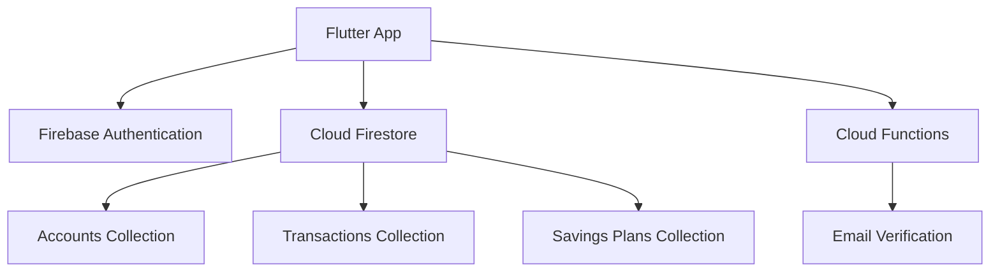

<div align="center">
  
  
  # Verdant Bank
  ### Mobile Banking Application
  
  
  
  
  
  
  **A comprehensive mobile banking solution with real-time features and modern UI**
  
  [Features](#features) • [Technology](#technology-stack) • [Setup](#setup-instructions) • [Architecture](#architecture)
  
</div>

---

## 📋 About This Project

This application was developed as a **collaborative university group project** to demonstrate proficiency in mobile application development, cloud integration, and financial software design. The project showcases modern development practices, including real-time data synchronization, secure authentication, and responsive UI design.

## ✨ Features

### 💳 Core Banking Operations
- **Account Management**: View account details, balance, and transaction history in real-time
- **Fund Transfers**: 
  - 🔄 Transfer between Verdant Bank accounts
  - 🏦 Transfer to other banks with transaction fees
  - 💰 Transfer to savings accounts
- **Bill Payments**: Pay utility bills, credit cards, internet, and other services
- **Mobile Load Purchase**: Buy prepaid mobile load for various networks

### 📈 Financial Services
- **Investment Platform**:
  - ₿ Cryptocurrency trading (buy/sell)
  - 📊 Stock market investments
  - 📉 Real-time market data visualization
- **Savings Goals**: 
  - 🎯 Create and manage multiple savings plans
  - 📊 Track progress with visual indicators
  - 📈 Savings history charts

### 🔒 Security & Authentication
- **Email Verification**: Secure account creation with email OTP verification
- **Firebase Authentication**: Industry-standard user authentication
- **Transaction Confirmation**: Slide-to-confirm mechanism for transactions
- **OTP Authorization**: Additional security layer for sensitive operations

### 🎨 User Experience
- **Animated UI**: Smooth transitions and engaging animations
- **Card Flip Animation**: Interactive card display with flip animations
- **Transaction Receipts**: Detailed receipts with save and share functionality
- **Real-time Updates**: Live balance and transaction updates using Firestore streams
- **Responsive Design**: Optimized for various screen sizes

## 🛠️ Technology Stack

<table>
<tr>
<td valign="top" width="50%">

### Frontend
-  Cross-platform mobile framework
-  Primary programming language

### Backend & Cloud Services
-  Backend infrastructure
- **Cloud Firestore**: Real-time NoSQL database
- **Firebase Authentication**: User management
- **Cloud Functions**: Serverless backend (Node.js)

</td>
<td valign="top" width="50%">

### Key Dependencies
| Package | Purpose |
|---------|---------|
| `fl_chart` | Financial data visualization |
| `google_fonts` | Custom typography |
| `intl` | Number formatting |
| `image_picker` | Document verification |
| `permission_handler` | Device permissions |
| `smooth_page_indicator` | Onboarding UI |
| `percent_indicator` | Progress visualization |

</td>
</tr>
</table>

## 🏗️ Architecture



### 📦 Data Models
| Model | Description |
|-------|-------------|
| **Account** | User account information and balance management |
| **Transaction** | Transaction records with source/destination tracking |
| **Plan** | Savings goals with progress tracking |

### ⚙️ Core Services
- **FirebaseService**: Centralized Firebase operations
- **UserSession**: Session management and user state
- **Firestore API**: Database operations and queries

### 🧩 Component Structure
- **Reusable Components**: Modular UI components (cards, buttons, receipts)
- **Authentication Screens**: Complete onboarding and verification flow
- **Feature Modules**: Self-contained modules for each banking feature

### 🗄️ Database Schema

**Firestore Collections:**
```
📁 accounts
  └── User account information (name, email, balance, phone)

📁 transactions
  └── Transaction records (type, amount, source, destination, timestamp)

📁 savingsPlans
  └── Savings goals (name, goal amount, current amount, history)
```

## 📂 Project Structure

```
verdant-bank/
├── 📱 android/                # Android-specific configurations
├── 🍎 ios/                    # iOS-specific configurations
├── 🌐 web/                    # Web platform support
├── ⚡ functions/              # Firebase Cloud Functions
│   └── index.js              # Email verification service
├── 🎨 assets/                 # Images, fonts, and resources
├── 📚 lib/
│   ├── alixScreens/          # 🔐 Authentication and onboarding screens
│   ├── animation_class/      # ✨ Custom animations
│   ├── api/                  # 🔌 API integration and Firestore operations
│   ├── components/           # 🧩 Reusable UI components
│   ├── models/               # 📊 Data models
│   ├── services/             # ⚙️ Business logic and services
│   ├── theme/                # 🎨 App theming and colors
│   ├── utils/                # 🛠️ Utility functions
│   ├── main.dart             # 🚀 Application entry point
│   └── [feature_screens].dart # Feature-specific screens
├── pubspec.yaml              # Dependencies and configuration
└── README.md                 # You are here! 📍
```

## 🚀 Setup Instructions

### Prerequisites

Before you begin, ensure you have the following installed:

- ✅ Flutter SDK 3.7.2 or higher
- ✅ Dart SDK
- ✅ Firebase project with Firestore and Authentication enabled
- ✅ Android Studio / Xcode for mobile development
- ✅ Node.js (for Firebase Functions)

### Installation

**1️⃣ Clone the repository**
```bash
git clone https://github.com/jeruzelcarpio/verdant-bank.git
cd verdant-bank
```

**2️⃣ Install dependencies**
```bash
flutter pub get
```

**3️⃣ Configure Firebase**

Create a Firebase project at [Firebase Console](https://console.firebase.google.com/)

- Enable **Firestore Database**
- Enable **Authentication** (Email/Password)
- Enable **Cloud Functions**

Add Firebase configuration files:
- 📄 Android: `google-services.json` → `android/app/`
- 📄 iOS: `GoogleService-Info.plist` → `ios/Runner/`

**4️⃣ Setup Cloud Functions**
```bash
cd functions
npm install
firebase deploy --only functions
```

**5️⃣ Run the application**
```bash
flutter run
```

### 📱 Supported Platforms
- ✅ Android
- ✅ iOS
- ⚠️ Web (Limited support)

## 💡 Key Features Implementation

<details>
<summary><b>🔄 Real-time Balance Updates</b></summary>
<br>
Utilizes Firestore <code>StreamBuilder</code> to provide live balance updates across all screens, ensuring data consistency and immediate reflection of transactions.
</details>

<details>
<summary><b>⚡ Transaction Processing</b></summary>
<br>
Implements Firestore transactions to ensure atomic operations when transferring funds between accounts, preventing race conditions and maintaining data integrity.
</details>

<details>
<summary><b>📊 Savings Goal Tracking</b></summary>
<br>
Visualizes savings progress with interactive charts using <code>fl_chart</code> package, with data persisted in Firestore for real-time synchronization across devices.
</details>

<details>
<summary><b>🔐 Multi-step Verification</b></summary>
<br>
Implements a secure onboarding process with ID verification, email confirmation, and document upload capabilities using Firebase Cloud Functions.
</details>

<details>
<summary><b>🎯 Slide-to-Confirm Transactions</b></summary>
<br>
Custom gesture-based confirmation system that prevents accidental transactions while providing smooth user experience.
</details>

## 👥 Development Team

This project was developed as a **university group project**, demonstrating:
- 🤝 Collaborative software development
- 📱 Modern mobile application architecture
- ☁️ Cloud integration and real-time systems
- 🔒 Secure authentication practices
- 🎨 UI/UX design principles

## 🤝 Contributing

This is an educational project developed for university coursework. While it's not actively maintained for production use, feedback and suggestions are welcome!

## 📄 License

This project is licensed under the **MIT License** - see below for details:

```
MIT License

Copyright (c) 2025 Verdant Bank Development Team

Permission is hereby granted, free of charge, to any person obtaining a copy
of this software and associated documentation files (the "Software"), to deal
in the Software without restriction, including without limitation the rights
to use, copy, modify, merge, publish, distribute, sublicense, and/or sell
copies of the Software, and to permit persons to whom the Software is
furnished to do so, subject to the following conditions:

The above copyright notice and this permission notice shall be included in all
copies or substantial portions of the Software.

THE SOFTWARE IS PROVIDED "AS IS", WITHOUT WARRANTY OF ANY KIND, EXPRESS OR
IMPLIED, INCLUDING BUT NOT LIMITED TO THE WARRANTIES OF MERCHANTABILITY,
FITNESS FOR A PARTICULAR PURPOSE AND NONINFRINGEMENT. IN NO EVENT SHALL THE
AUTHORS OR COPYRIGHT HOLDERS BE LIABLE FOR ANY CLAIM, DAMAGES OR OTHER
LIABILITY, WHETHER IN AN ACTION OF CONTRACT, TORT OR OTHERWISE, ARISING FROM,
OUT OF OR IN CONNECTION WITH THE SOFTWARE OR THE USE OR OTHER DEALINGS IN THE
SOFTWARE.
```

## ⚠️ Disclaimer

**Important Notice:**
- 🎓 This is an educational project developed for university coursework
- 💡 Not intended for production use
- 💰 All financial transactions are simulated
- 🚫 No real money is involved
- 📚 Developed for learning and demonstration purposes

---

<div align="center">
  
  ### 🌟 If you found this project interesting, please consider giving it a star! ⭐
  
  **Built with ❤️ by university students**
  
  [Report Bug](https://github.com/jeruzelcarpio/verdant-bank/issues) • [Request Feature](https://github.com/jeruzelcarpio/verdant-bank/issues)
  
</div>
